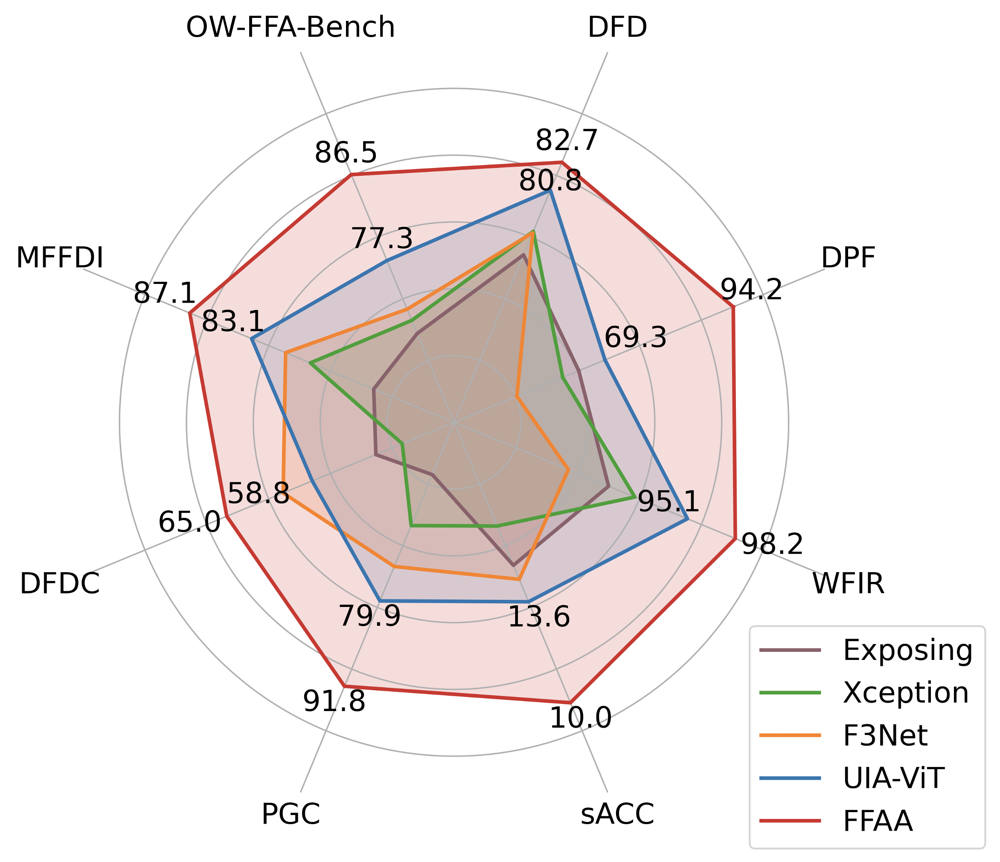

# Model Zoo

The model weights are composed of two parts: fine-tuned LLaVA and MIDS. For convenience, we combined and uploaded them to the huggingface. Actually, they are two independent modules.

## FFAA-v1

    
    
FFAA achieves SoTA generalization performance on the OW-FFA-Bench

| Version | MLLM        | Schedule | Checkpoint                                         | DPF  | DFD  | DFDC | PGC  | WFIR | MFFDI | ALL(ACC) | ALL(AUC) | ALL(AP) | sACC |
| ------- | ---------- | -------- | -------------------------------------------------- | ---- | ---- | ---- | ---- | ---- | ----- | -------- | -------- | ------- | ---- |
| FFAA-v1 | LLaVA-v1.6-Mistral-7B | LoRA ft  | https://huggingface.co/thu-huangzc/ffaa-mistral-7b | 94.2 | 82.7 | 65.0 | 91.8 | 98.2 | 87.1  | 86.5     | 94.4     | 95.5    | 10.0 |

